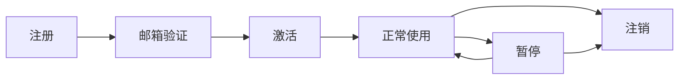

# Rookie 功能特性详解

## 🎯 功能概览

Rookie 提供了企业级Web应用所需的完整功能模块，以下是详细的功能特性说明。

## 🔐 认证与授权

### 用户认证

| 功能 | 描述 | 状态 | 优势 |
|------|------|------|------|
| **邮箱密码登录** | 传统的邮箱+密码认证方式 | ✅ 已实现 | 简单可靠，用户熟悉 |
| **Token认证** | RESTful API Token认证 | ✅ 已实现 | 无状态，适合API调用 |
| **Session认证** | 基于Cookie的会话认证 | ✅ 已实现 | 适合Web界面交互 |
| **第三方登录** | OAuth2.0第三方平台登录 | ✅ 已实现 | 提升用户体验，减少密码管理 |
| **双因子认证** | 短信/邮箱验证码二次验证 | 🔄 计划中 | 增强账户安全性 |
| **生物识别** | 指纹/面部识别登录 | 📋 待规划 | 现代化认证体验 |

### 第三方登录支持

| 平台 | 登录方式 | 用户同步 | 组织架构同步 | 状态 |
|------|----------|----------|--------------|------|
| **钉钉** | 扫码登录 | ✅ | ✅ | ✅ 已实现 |
| **企业微信** | 扫码登录 | ✅ | ✅ | ✅ 已实现 |
| **飞书** | 扫码登录 | ✅ | ✅ | 🔄 开发中 |
| **GitHub** | OAuth登录 | ✅ | ❌ | 📋 计划中 |
| **Google** | OAuth登录 | ✅ | ❌ | 📋 计划中 |
| **微软AD** | LDAP/SAML | ✅ | ✅ | 📋 计划中 |

### 权限控制

| 功能 | 描述 | 实现方式 | 状态 |
|------|------|----------|------|
| **模块权限** | 基于业务模块的权限控制 | 自定义权限模型 | ✅ 已实现 |
| **角色管理** | 用户组和角色分配 | Django Groups扩展 | ✅ 已实现 |
| **权限继承** | 部门级权限继承机制 | 树形结构权限 | ✅ 已实现 |
| **动态权限** | 运行时权限检查 | 装饰器+中间件 | ✅ 已实现 |
| **权限审计** | 权限变更历史记录 | 审计日志 | 🔄 开发中 |
| **临时权限** | 基于时间的临时授权 | 过期时间控制 | ✅ 已实现 |

## 👥 用户管理

### 用户模型

| 字段 | 类型 | 描述 | 必填 | 唯一 |
|------|------|------|------|------|
| **id** | UUID | 用户唯一标识 | ✅ | ✅ |
| **email** | EmailField | 邮箱地址（登录名） | ✅ | ✅ |
| **username** | CharField | 用户名 | ✅ | ✅ |
| **phone** | CharField | 手机号码 | ❌ | ❌ |
| **avatar** | URLField | 头像URL | ❌ | ❌ |
| **department** | CharField | 所属部门 | ❌ | ❌ |
| **job_title** | CharField | 职位名称 | ❌ | ❌ |
| **employee_id** | CharField | 工号 | ❌ | ❌ |
| **external_id** | CharField | 第三方平台ID | ❌ | ❌ |
| **auth_source** | CharField | 认证来源 | ❌ | ❌ |

### 用户生命周期



| 状态 | 描述 | 可执行操作 | 权限 |
|------|------|------------|------|
| **未验证** | 注册后未验证邮箱 | 验证邮箱、重发验证邮件 | 无权限 |
| **已激活** | 正常可用状态 | 登录、使用系统功能 | 完整权限 |
| **已暂停** | 临时禁用状态 | 无法登录 | 无权限 |
| **已注销** | 永久禁用状态 | 无法恢复 | 无权限 |

## 📊 API系统

### 响应格式

```json
{
  "success": true,
  "code": 200,
  "message": "操作成功",
  "data": {
    "user": {
      "id": "uuid-here",
      "email": "user@example.com"
    }
  },
  "timestamp": "2024-01-01T00:00:00Z",
  "request_id": "abc12345"
}
```

### API特性

| 特性 | 描述 | 实现方式 | 状态 |
|------|------|----------|------|
| **统一响应** | 标准化的响应格式 | 响应包装器 | ✅ 已实现 |
| **错误处理** | 全局异常处理 | 自定义异常处理器 | ✅ 已实现 |
| **API文档** | 自动生成的接口文档 | drf-spectacular | ✅ 已实现 |
| **版本控制** | API版本管理 | URL版本控制 | 🔄 开发中 |
| **限流保护** | API调用频率限制 | Django-ratelimit | 📋 计划中 |
| **缓存机制** | API响应缓存 | Redis缓存 | 📋 计划中 |

### 核心API端点

| 端点 | 方法 | 描述 | 认证要求 |
|------|------|------|----------|
| `/api/users/register/` | POST | 用户注册 | 无 |
| `/api/users/login/` | POST | 用户登录 | 无 |
| `/api/users/logout/` | POST | 用户登出 | Token |
| `/api/users/profile/` | GET | 获取用户信息 | Token |
| `/api/users/profile/` | PUT/PATCH | 更新用户信息 | Token |
| `/api/users/my_modules/` | GET | 获取用户权限模块 | Token |
| `/api/users/third_party_providers/` | GET | 获取第三方登录方式 | 无 |
| `/api/users/sync_users/` | POST | 同步第三方用户 | 管理员 |

## 🎨 管理界面

### SimpleUI特性

| 功能 | 描述 | 自定义程度 | 状态 |
|------|------|------------|------|
| **Ant Design主题** | 基于Ant Design的现代化界面 | 高 | ✅ 已实现 |
| **响应式布局** | 适配桌面和移动端 | 中 | ✅ 已实现 |
| **暗色主题** | 支持暗色/亮色主题切换 | 高 | ✅ 已实现 |
| **自定义Logo** | 支持自定义品牌Logo | 高 | ✅ 已实现 |
| **菜单配置** | 可配置的侧边栏菜单 | 高 | ✅ 已实现 |
| **首页定制** | 自定义管理首页 | 高 | 🔄 开发中 |

### 管理功能

| 模块 | 功能 | 操作权限 | 状态 |
|------|------|----------|------|
| **用户管理** | 用户CRUD、权限分配 | 超级管理员 | ✅ 已实现 |
| **权限管理** | 模块权限配置 | 超级管理员 | ✅ 已实现 |
| **第三方配置** | 第三方登录配置 | 超级管理员 | ✅ 已实现 |
| **系统日志** | 操作日志查看 | 管理员 | 🔄 开发中 |
| **系统监控** | 系统状态监控 | 管理员 | 📋 计划中 |

## 🔧 工具模块

### 日志系统

| 功能 | 描述 | 配置 | 状态 |
|------|------|------|------|
| **结构化日志** | JSON格式的结构化日志 | Loguru配置 | ✅ 已实现 |
| **多级别日志** | DEBUG/INFO/WARNING/ERROR | 环境变量控制 | ✅ 已实现 |
| **文件轮转** | 按大小/时间轮转日志文件 | 自动配置 | ✅ 已实现 |
| **远程日志** | 发送到远程日志服务 | 可选配置 | 📋 计划中 |
| **日志分析** | 日志统计和分析 | ELK集成 | 📋 计划中 |

### 响应包装器

```python
# 成功响应
ApiResponse.success(data=user_data, message="操作成功")

# 错误响应
ApiResponse.error(message="操作失败", code=400)

# 验证错误
ApiResponse.validation_error(data=serializer.errors)
```

### 权限工具

```python
# 装饰器方式
@require_module_permission('user_management', 'view')
def user_list(request):
    pass

# 函数调用方式
if permission_checker.has_module_permission(user, 'user_management', 'view'):
    # 有权限的操作
    pass
```

## 🚀 部署与运维

### 部署方案

| 方案 | 描述 | 适用场景 | 复杂度 |
|------|------|----------|--------|
| **开发部署** | 单机Django开发服务器 | 本地开发测试 | 低 |
| **Docker部署** | 容器化部署方案 | 测试和生产环境 | 中 |
| **K8s部署** | Kubernetes集群部署 | 大规模生产环境 | 高 |
| **云服务部署** | 云平台PaaS部署 | 快速上线 | 低 |

### 监控指标

| 指标类型 | 具体指标 | 监控工具 | 告警阈值 |
|----------|----------|----------|----------|
| **性能指标** | 响应时间、吞吐量、错误率 | Prometheus | 响应时间>500ms |
| **资源指标** | CPU、内存、磁盘使用率 | Node Exporter | CPU>80% |
| **业务指标** | 用户登录数、API调用数 | 自定义指标 | 异常波动 |
| **安全指标** | 登录失败次数、异常访问 | 日志分析 | 失败率>10% |

## 📈 性能优化

### 数据库优化

| 优化项 | 实现方式 | 效果 | 状态 |
|--------|----------|------|------|
| **查询优化** | select_related/prefetch_related | 减少N+1查询 | ✅ 已实现 |
| **索引优化** | 为常用查询字段添加索引 | 提升查询速度 | ✅ 已实现 |
| **连接池** | 数据库连接池配置 | 减少连接开销 | ✅ 已实现 |
| **读写分离** | 主从数据库配置 | 分散数据库压力 | 📋 计划中 |

### 缓存策略

| 缓存类型 | 缓存内容 | 过期时间 | 状态 |
|----------|----------|----------|------|
| **用户缓存** | 用户基本信息 | 30分钟 | 🔄 开发中 |
| **权限缓存** | 用户权限信息 | 15分钟 | 🔄 开发中 |
| **配置缓存** | 系统配置信息 | 1小时 | 📋 计划中 |
| **API缓存** | API响应结果 | 5分钟 | 📋 计划中 |

## 🔒 安全特性

### 安全防护

| 安全威胁 | 防护措施 | 实现方式 | 状态 |
|----------|----------|----------|------|
| **SQL注入** | 参数化查询 | Django ORM | ✅ 已实现 |
| **XSS攻击** | 输入过滤和输出编码 | Django模板 | ✅ 已实现 |
| **CSRF攻击** | CSRF Token验证 | Django中间件 | ✅ 已实现 |
| **暴力破解** | 登录频率限制 | Redis计数器 | 🔄 开发中 |
| **会话劫持** | 安全Cookie配置 | Django设置 | ✅ 已实现 |

### 数据保护

| 数据类型 | 保护措施 | 实现方式 | 状态 |
|----------|----------|----------|------|
| **密码** | 哈希加密存储 | Django认证系统 | ✅ 已实现 |
| **敏感信息** | 字段级加密 | 自定义加密字段 | 📋 计划中 |
| **API密钥** | 环境变量存储 | Docker Secrets | ✅ 已实现 |
| **日志脱敏** | 敏感信息过滤 | 自定义日志过滤器 | 🔄 开发中 |

## 🌍 扩展性

### 插件系统

| 插件类型 | 扩展点 | 开发难度 | 文档完整度 |
|----------|--------|----------|------------|
| **认证插件** | 第三方登录 | 中 | ✅ 完整 |
| **权限插件** | 权限检查器 | 中 | 🔄 部分 |
| **通知插件** | 消息推送 | 低 | 📋 待完善 |
| **存储插件** | 文件存储 | 低 | 📋 待完善 |

### 配置管理

| 配置类型 | 配置方式 | 热更新 | 状态 |
|----------|----------|--------|------|
| **环境配置** | 环境变量 | ❌ | ✅ 已实现 |
| **数据库配置** | Django设置 | ❌ | ✅ 已实现 |
| **第三方配置** | 数据库存储 | ✅ | ✅ 已实现 |
| **功能开关** | 配置中心 | ✅ | 📋 计划中 |

---

## 📊 功能成熟度评估

| 模块 | 完成度 | 稳定性 | 文档完整度 | 测试覆盖率 |
|------|--------|--------|------------|------------|
| **用户管理** | 95% | 高 | 90% | 85% |
| **权限控制** | 90% | 高 | 85% | 80% |
| **第三方登录** | 85% | 中 | 80% | 75% |
| **API系统** | 90% | 高 | 95% | 85% |
| **管理界面** | 80% | 中 | 70% | 60% |
| **工具模块** | 85% | 高 | 85% | 80% |

## 🎯 版本规划

### v1.0.0 (当前版本)
- ✅ 基础用户管理
- ✅ 权限控制系统
- ✅ 第三方登录集成
- ✅ API文档生成
- ✅ Docker部署支持

### v1.1.0 (下个版本)
- 🔄 移动端界面优化
- 🔄 权限系统可视化
- 🔄 操作审计日志
- 🔄 性能监控面板

### v1.2.0 (未来版本)
- 📋 微服务架构支持
- 📋 GraphQL API
- 📋 实时通知系统
- 📋 工作流引擎

---

**最后更新**: 2024-01-01  
**文档版本**: v1.0.0